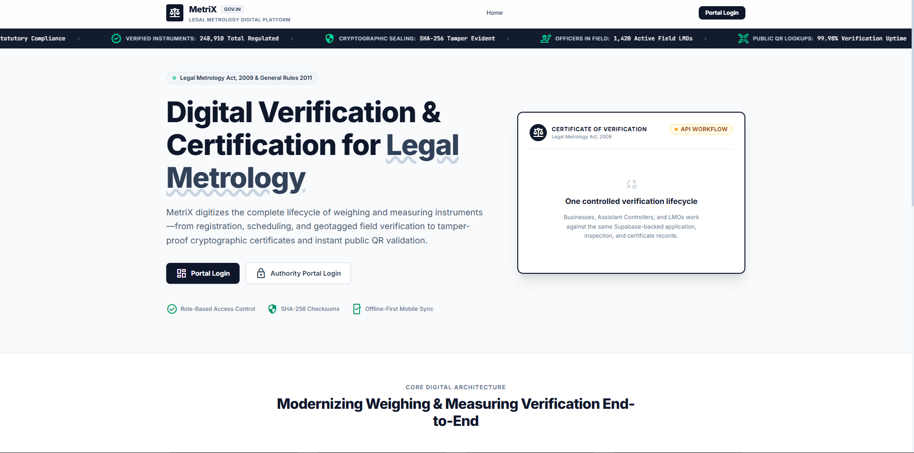

# MetriX

Digital Legal Metrology Verification and Certification Platform

MetriX is a Smart India Hackathon prototype for digitizing the verification, re-verification, inspection, certification, and public validation lifecycle of weighing and measuring instruments under the Legal Metrology Act, 2009 and the Legal Metrology (General) Rules, 2011.

The prototype replaces a manual, paper-heavy workflow with a secure web platform where businesses submit verification applications, Assistant Controllers review and assign inspections, Legal Metrology Officers record field results, and the final certificate can be verified publicly through a QR code.

## Live Prototype

Frontend:

```text
https://sih-project-theta-ashy.vercel.app
```

Backend health check:

```text
https://sih-project-bpyq.onrender.com/api/health
```

Demo account credentials are intentionally not committed to the repository. They should be shared only through the official demo channel.

## Project Preview



## SIH Problem Fit

MetriX addresses the core SIH requirement for a unified online verification and digital certification system for Legal Metrology.

Implemented in the current web prototype:

- Online registration and profile completion for business users.
- Government role-based login for Legal Metrology Officers, Assistant Controllers, and System Admins.
- Business instrument registration with purchase bill upload.
- Verification and re-verification application submission.
- Assistant Controller review, acceptance, rejection, and LMO assignment.
- LMO inspection workspace with digital measurement entry, evidence upload, and result submission.
- Assistant Controller final review and approval/return workflow.
- Digital certificate generation after successful approval.
- QR-enabled public certificate verification through `/verify/[id]`.
- Certificate expiry status based on authoritative `valid_until` data.
- Dashboards and role-specific protected portals.
- Supabase-backed Auth, PostgreSQL, Storage, RLS, and audit-ready data model.

Intentionally out of scope for this SIH web prototype:

- GATC workflow.
- Production Flutter/mobile deployment.
- External SMS/email notification services.
- Government SSO.
- Full statutory Legal Metrology rules engine.
- Advanced analytics and reporting beyond prototype dashboards.

## Architecture

```text
Browser
  -> Vercel: Next.js web portal
  -> Render: Express REST API
  -> Supabase: PostgreSQL, Auth, private Storage, RLS
```

The runtime source of truth is Supabase PostgreSQL. The frontend does not act as a trusted authority for role, district, ownership, or certificate status decisions.

## Tech Stack

Frontend:

- Next.js 16
- JavaScript
- Tailwind CSS
- shadcn-style local UI components
- Supabase browser and SSR auth clients
- QR rendering with `qrcode.react`

Backend:

- Node.js
- Express.js
- REST APIs
- Supabase server client
- Server-side authorization services

Database, Auth, and Storage:

- Supabase PostgreSQL
- Supabase Auth
- Supabase Storage
- Row Level Security policies
- SQL migrations under `supabase/migrations`

Deployment:

- Vercel for the frontend
- Render for the backend
- Supabase for managed database, auth, and storage
- GitHub as source repository

## Repository Structure

```text
.
├── backend/                 Express API, services, repositories, tests
├── frontend/web/            Next.js web application
├── mobile/                  Flutter field-app prototype, not part of deployment
├── supabase/migrations/     PostgreSQL schema, RLS, storage, triggers, RPCs
├── PRD/                     Product requirement documents
└── readme.md                Project overview
```

## Roles

MetriX supports four active web roles:

```text
BUSINESS
LMO
ASSISTANT_CONTROLLER
SYSTEM_ADMIN
```

Role trust model:

- Supabase Auth verifies identity.
- The backend reads role and account status from `profiles`.
- The frontend route middleware also checks authenticated user, role, and scoped route access.
- Protected backend APIs require a Supabase bearer token.
- Server-side services enforce ownership, role, district, and assignment constraints.

## Core Workflow

```text
Business registers/logs in
Business completes profile
Business adds instrument
Business uploads purchase bill
Business creates verification or re-verification application
Business submits application

Assistant Controller reviews fresh applications
Assistant Controller accepts or rejects
Assistant Controller assigns an LMO

LMO opens assigned inspection
LMO records measurement values and observations
LMO uploads evidence
LMO submits verification

Assistant Controller reviews submitted verification
Assistant Controller approves or returns

Approval creates digital certificate
Certificate QR opens public verification page
Public user sees VALID or EXPIRED status
```

Certificates are not generated during application submission or initial acceptance. They are generated only after the inspection passes and the Assistant Controller grants final approval.

## Certificate and QR Verification

Certificate behavior in the current prototype:

- Certificate ID is tied to the approved application.
- Duplicate certificate generation is blocked.
- Certificate status is evaluated against `valid_until`.
- Public verification is available without login.
- QR codes point to the deployed web origin and open `/verify/[certificateId]`.
- Expired certificates show expired status when opened after validity ends.

## Security Model

Security controls implemented for the prototype:

- Supabase Auth for identity.
- Server-side Express authorization for role-sensitive APIs.
- Supabase RLS policies for database-level protection.
- Private Supabase Storage buckets for uploaded documents and evidence.
- District scoping for Assistant Controller and LMO workflows.
- Business ownership checks for instruments, applications, and certificates.
- System Admin-only APIs for administrative account management.
- Public access limited to certificate verification and district reference data.

Important security rule:

```text
Never expose SUPABASE_SECRET_KEY in frontend or NEXT_PUBLIC_* variables.
```

## API Overview

All protected API calls use:

```http
Authorization: Bearer <Supabase access token>
```

Important backend routes:

```text
GET  /api/health
GET  /api/auth/profile
POST /api/auth/register-business
GET  /api/public/districts
GET  /api/dashboard/stats
GET  /api/business/profile
PUT  /api/business/profile
GET  /api/instruments
POST /api/instruments
GET  /api/applications
POST /api/applications
POST /api/applications/:id/accept
POST /api/applications/:id/reject
POST /api/applications/:id/assign
GET  /api/inspections
POST /api/inspections/:id/start
POST /api/inspections/:id/submit
GET  /api/approvals/awaiting
POST /api/approvals/approve
POST /api/approvals/return
GET  /api/certificates
GET  /api/public/certificates/:id
POST /api/documents/upload
GET  /api/admin/dashboard
GET  /api/admin/assistant-controllers
POST /api/admin/assistant-controllers
GET  /api/admin/lmos
GET  /api/admin/audit-logs
```

## Local Development

Backend:

```bash
cd backend
npm install
npm start
```

Frontend:

```bash
cd frontend/web
npm install
npm run dev
```

Open:

```text
http://localhost:3000
```

Backend health:

```text
http://localhost:5001/api/health
```

## Environment Variables

Backend `.env`:

```env
PORT=5001
SUPABASE_URL=https://your-project-ref.supabase.co
SUPABASE_SECRET_KEY=your-server-only-secret-key
SUPABASE_PUBLISHABLE_KEY=your-publishable-key
CORS_ORIGIN=http://localhost:3000
FRONTEND_URL=http://localhost:3000
```

Frontend `frontend/web/.env.local`:

```env
NEXT_PUBLIC_API_URL=http://localhost:5001/api
NEXT_PUBLIC_SUPABASE_URL=https://your-project-ref.supabase.co
NEXT_PUBLIC_SUPABASE_PUBLISHABLE_KEY=your-publishable-key
```

Production frontend example:

```env
NEXT_PUBLIC_API_URL=https://sih-project-bpyq.onrender.com/api
NEXT_PUBLIC_SUPABASE_URL=https://your-project-ref.supabase.co
NEXT_PUBLIC_SUPABASE_PUBLISHABLE_KEY=your-publishable-key
```

Production backend example:

```env
NODE_ENV=production
NODE_VERSION=22
SUPABASE_URL=https://your-project-ref.supabase.co
SUPABASE_SECRET_KEY=your-server-only-secret-key
SUPABASE_PUBLISHABLE_KEY=your-publishable-key
CORS_ORIGIN=https://sih-project-theta-ashy.vercel.app
FRONTEND_URL=https://sih-project-theta-ashy.vercel.app
```

Do not commit real `.env` files.

## Supabase Setup

Apply migrations:

```bash
supabase login
supabase link --project-ref <PROJECT_REF>
supabase db push
```

Import Indian state and district reference data:

```bash
cd backend
npm run import:districts
```

The migrations define:

- Application and certificate workflow tables.
- Profiles and role-specific records.
- RLS policies.
- Storage buckets.
- Triggers and workflow RPCs.
- System Admin portal support.

Create the first System Admin manually through Supabase Auth and a matching `profiles` row. Do not commit admin credentials.

## Deployment

Render backend:

```text
Service type: Web Service
Root Directory: backend
Build Command: npm install
Start Command: npm start
Health Check Path: /api/health
Node Version: 22
```

Vercel frontend:

```text
Framework Preset: Next.js
Root Directory: frontend/web
Build Command: npm run build
Output Directory: default
Install Command: default or npm install
```

After changing any `NEXT_PUBLIC_*` variable in Vercel, redeploy the frontend because those values are compiled into the browser bundle.

## Verification Checklist

Before demo:

- Backend `/api/health` returns `HEALTHY`.
- Vercel `/`, `/login`, and `/verify` routes open.
- Business registration and login work.
- Business can complete profile, add instrument, upload purchase bill, and submit application.
- Assistant Controller can see fresh application, accept/reject, and assign LMO.
- LMO can see assigned inspection, enter multiple measurements, upload evidence, and submit.
- Assistant Controller can approve final verification.
- Certificate is generated once.
- QR opens public verification page.
- Valid certificate shows valid status.
- Expired certificate shows expired status.
- Certificate print view renders correctly.
- Unauthorized API calls return `401`.
- Cross-role and cross-district actions are blocked.

## Testing

Backend syntax check:

```bash
cd backend
find src -name '*.js' -exec node --check {} \;
```

Frontend checks:

```bash
cd frontend/web
npm run lint
npm run build
```

Optional backend workflow tests are available in:

```text
backend/test_e2e_scenarios.js
backend/test_admin_scenarios.js
```

Run them only against a disposable Supabase project or a clean demo dataset.

## Documentation

Final PRD:

```text
PRD/MetriX_Final_PRD.md
```

Additional project documents:

```text
PRD/MetriX_PRD_v1.0.md
PRD/web_Frontend.md
supabase/README.md
frontend/web/README.md
mobile/README.md
```

## Project Status

MetriX is ready as a deployable SIH web prototype for the current intended scope:

- Web-based stakeholder portals.
- Supabase-backed identity, database, and storage.
- Express-based workflow and authorization engine.
- QR-enabled digital certificate verification.
- Practical deployment on Vercel, Render, and Supabase.

The prototype focuses on demonstrating a complete, auditable Legal Metrology verification lifecycle without overextending into GATC, full mobile production, government SSO, or advanced rule-engine complexity.
